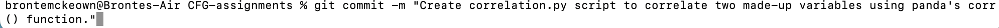
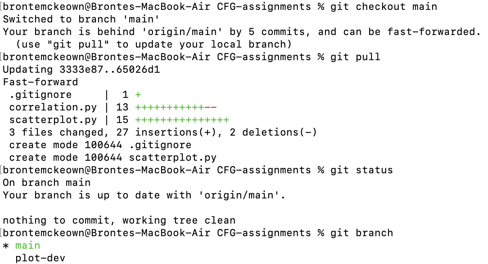

# CFG Assignments

### About me

#### Background
My name is Dr. Bronte Mckeown and I have a background in Psychology and Neuroscience. I completed my PhD in Neuroscience at the University of York in September 2022, and then carried on my research in Canada for 18 months! Having returned to the UK, I have recently started a new freelance role back at the National Institute of Teaching, which I absolutely love. I am *super* excited to complete the CFGdegree as I hope it will improve both my technical skills and my confidence.

#### Links to find out more about my research
- [LinkedIn](www.linkedin.com/in/bronte-mckeown)
- [Google Scholar](https://scholar.google.com/citations?user=5HWZCp0AAAAJ&hl=en)
- [Latest study](https://www.researchsquare.com/article/rs-4131471/v1)

### Assignment 1

#### Part 1
Part 1 is worth **14 marks**. These 14 marks are awarded for: "Demonstration of setting up GitHub and use of README."

Specifically, I need to:
- [x] Create a GitHub account.
- [x] Create a private repository.
- [x] Create a README.md file that contains information about me and what I'll be using GitHub for in this assignment.
    
- This README.md needs to contain *at least* 6 different markdown text formatting features. I have decided to use:
  - [x] Headings
  - [x] Bold
  - [x] Italic
  - [x] Quoting code 
  - [x] Links to URLs
  - [x] Lists
  - [x] Task lists
  - [x] Images
  - [x] Relative links to files in repo

#### Part 2

Part 2 is also worth **14 marks**. These 14 marks are awarded for: "Knowledge and demonstrated use of GitHub commands."

Specifically, I need to demonstrate:
- [x] Checking the status
- [x] Creating a branch
- [x] Adding files to a branch
- [x] Adding commits with meaningful messages
- [x] Opening a pull request
- [x] Merging and deploying to main branch
- [x] .gitignore file (with explanation)
- [x] requirements.txt file (with explanation)

#### My chosen project to demonstrate Part 2 knowledge

To demonstrate the skills required for Part 2, I have used Python to run a correlation analysis on some made-up data and visualise the correlation with a scatter plot. I've documented these steps, with screenshots.

**1. After creating this remote repository on GitHub, I created a local copy on my machine using `git clone`.**

**2. I then wrote a Python script that creates two [pandas](https://pandas.pydata.org/) series and correlates the two series using [panda's](https://pandas.pydata.org/) [.corr()](https://pandas.pydata.org/pandas-docs/stable/reference/api/pandas.Series.corr.html) function. You can see this script [here](assignment1/correlation.py).**

**3. I used `git status` to see this change.**

**4. I then used `git add` to add this change to the staging area and `git commit` to commit this change to my git history with a message.**

**5. I then created a new branch called 'plot-dev' using `git checkout` and switched to this branch using the `-b` flag. In this branch, I wrote a new [Python script](assignment1/scatterplot.py) that plots a scatter plot showing the association between the two same two variables using [seaborn's](https://seaborn.pydata.org/index.html) [.scatterplot()](https://seaborn.pydata.org/generated/seaborn.scatterplot.html) function.**

   
   
**6. I then used `git push` to publish 'plot-dev' branch to the remote repository.**

   
   
   
**7. On GitHub, I then opened a pull request and merged the changes on 'plot-dev' branch to the main branch.**

   

   

    

    
**8. I then used `git fetch` (not shown) and `git pull` on my local machine to reflect this merging.**

    

**9. I also created a [.gitignore file](.gitignore) using `touch`. This file tells git to *not* track the changes of any files or directories listed. In my case, I added the homework instructions word document and the csv filed (data.csv) created by the correlation.py script.**

**10. Finally, I created a [requirements.txt](assignment1/requirements.txt) file using `pip freeze`, which lists all the modules and packages (and their versions) loaded in my environment, and can be used by users of the project to install all the necessary modules and packages needed to run the analysis scripts.**
