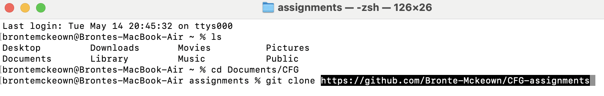
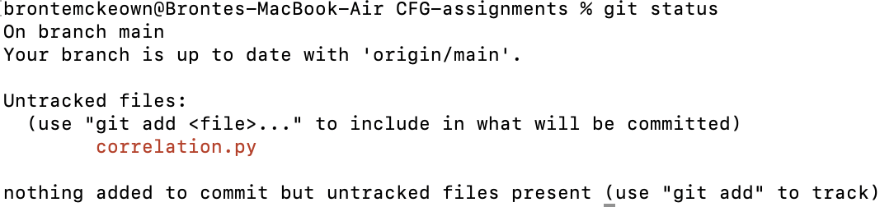
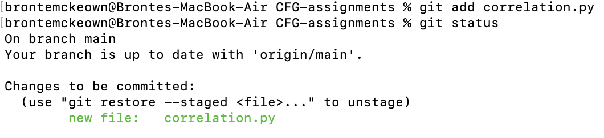
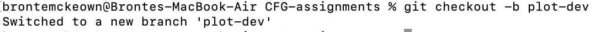
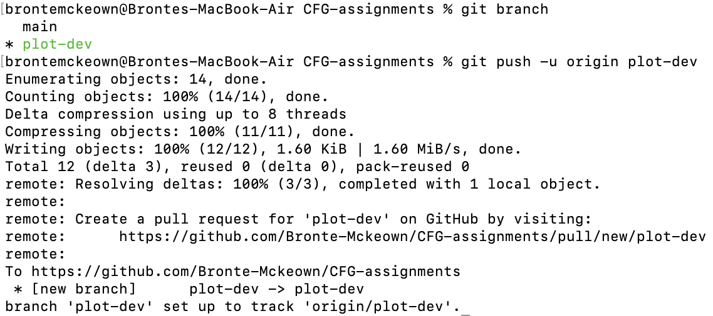
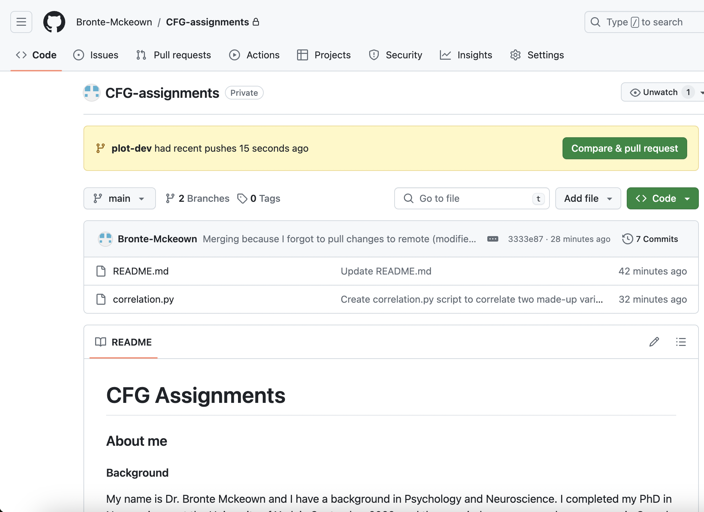
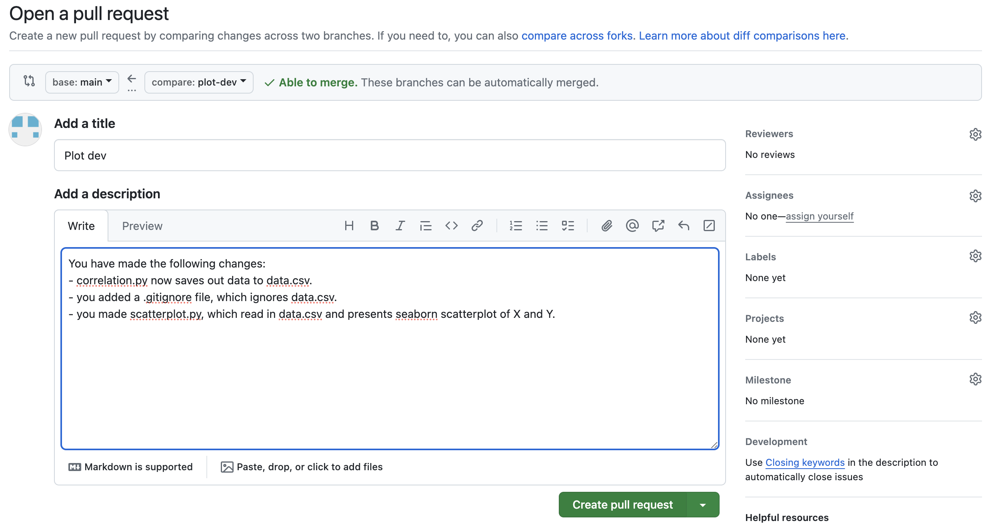
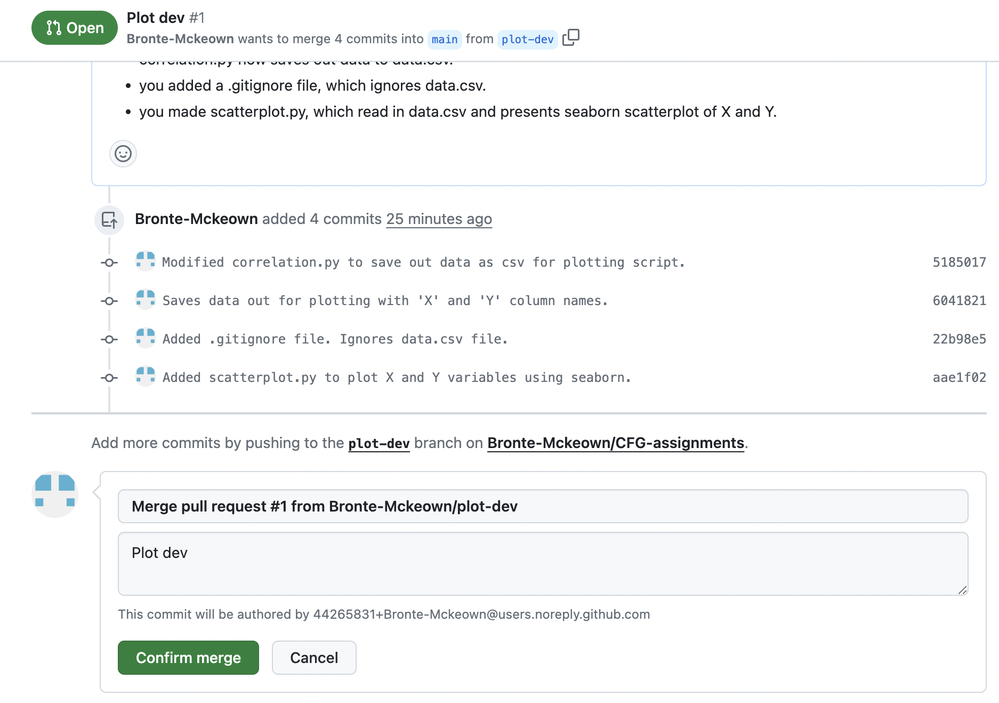

# CFG Assignments

### About me

#### Background
My name is Dr. Bronte Mckeown and I have a background in Psychology and Neuroscience. I completed my PhD in Neuroscience at the University of York in September 2022, and then carried on my research programme in Canada for 18 months! Having returned to the UK, I have recently started a new freelance role back at the National Institute of Teaching, which I absolutely love. I am *super* excited to complete the CFGdegree as I hope it will improve both my technical skills and my confidence.

#### Links to find out more
- [LinkedIn](www.linkedin.com/in/bronte-mckeown)
- [Google Scholar](https://scholar.google.com/citations?user=5HWZCp0AAAAJ&hl=en)
- [Latest study](https://www.researchsquare.com/article/rs-4131471/v1)

### Assignment 1

#### Part 1
Part 1 is worth **14 marks**. These 14 marks are awarded for: "Demonstration of setting up GitHub and use of README."

Specifically, I need to:
- [x] Create a GitHub account.
- [x] Create a private repository.
- [x] Create a README.md file that contains information about me and what I'll be using GitHub for in this assignment.
    
- This README.md needs to contain *at least* 6 different markdown text formatting features. I have decided to use:
  - [x] Headings
  - [x] Bold
  - [x] Italic
  - [x] Quoting code 
  - [x] Links to URLs
  - [x] Lists
  - [x] Task lists
  - [x] Images

#### Part 2

Part 2 is also worth **14 marks**. These 14 marks are awarded for: "Knowledge and demonstrated use of GitHub commands."

Specifically, I need to demonstrate:
- [x] Checking the status
- [x] Create a branch
- [x] Adding files to a branch
- [x] Adding commits with meaningful messages
- [x] Opening a pull request
- [x] Merging and deploying to main branch
- [x] .gitignore file (with explanation)
- [x] requirements.txt file (with explanation)

##### The project to demonstrate Part 2 steps

I have used Python to run a correlation analysis on some made-up data and visualise the correlation with a scatter plot. I've broken this down below, with screenshots.

1. After creating this remote repository on GitHub, I created a local copy on my machine using `git clone`.

2. I then created a Python script that creates two series stored in [pandas](https://pandas.pydata.org/) series.
- I then correlated the two series using [panda's](https://pandas.pydata.org/) [.corr()](https://pandas.pydata.org/pandas-docs/stable/reference/api/pandas.Series.corr.html) function.
    - The result is printed out to the console using `print()` statement.
3. I used `git status` to see this change. 
4. I then used `git add` and `git commit`. 
5. I then created a new branch called 'plot-dev'. In this branch, I created a new Python script that plots a scatter plot showing the association between the two variables using [seaborn's](https://seaborn.pydata.org/index.html) [.scatterplot()](https://seaborn.pydata.org/generated/seaborn.scatterplot.html) function.

6. I then used `git push` to publish 'plot-dev' branch to the remote repository 
7. On GitHub, I then opened a pull request and merged the changes on 'plot-dev' branch to the main branch.

8. Finally, I used `git fetch` and `git pull` on my local machine to reflect this merging.
